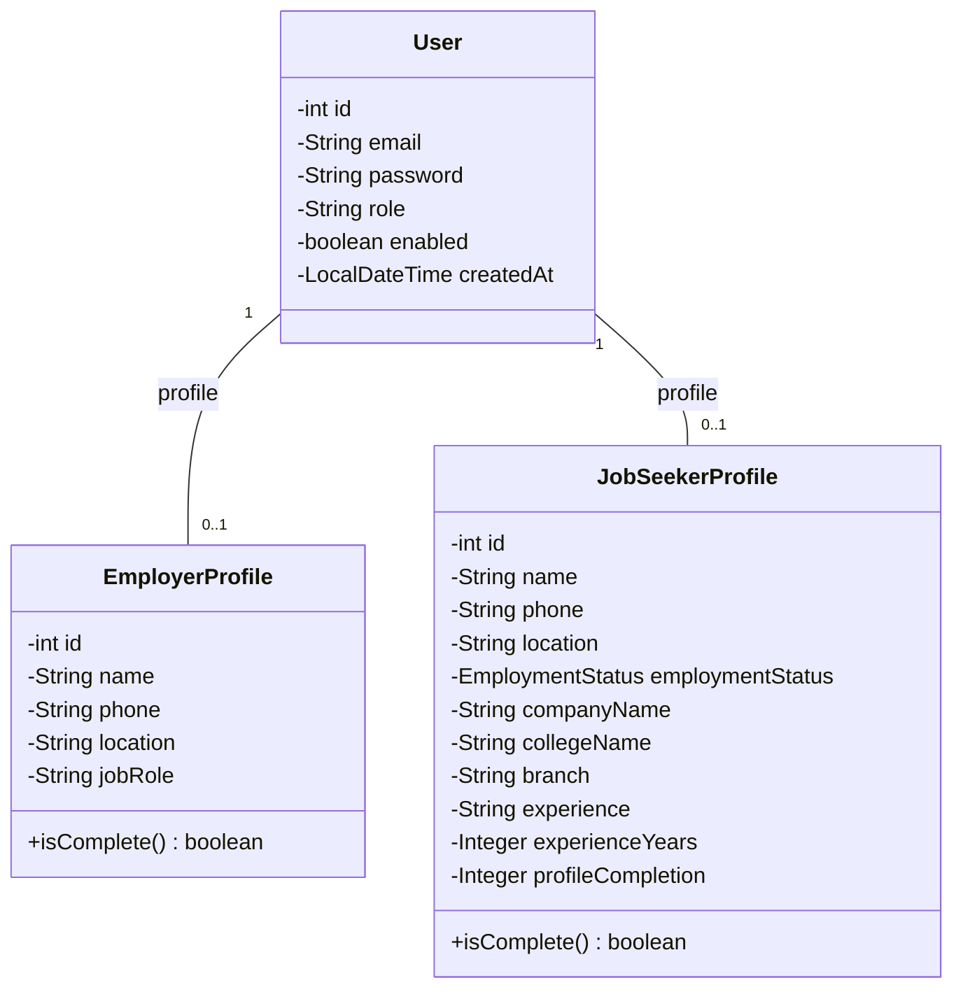
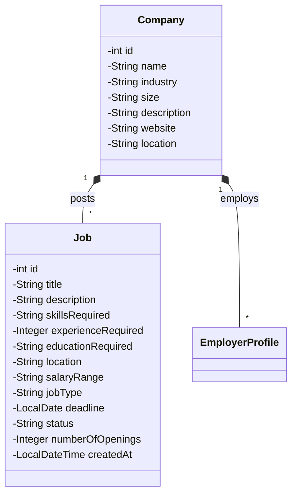
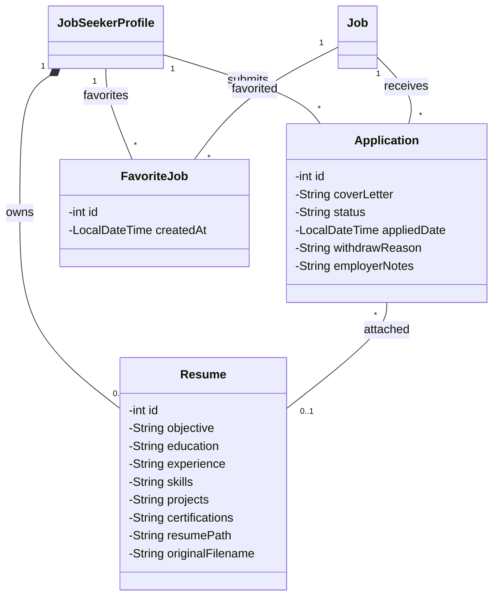

# RevHire - Class Diagrams

Here are 3 distinct Class Diagrams breaking down the core domains of the application:

## 1. User & Profile Management
This diagram shows the relationship between the base `User` and the respective profiles for `Employer` and `JobSeeker`.

## 2. Job & Company Management
This diagram illustrates the relationship between `Company` and `Job` postings.

## 3. Application & Resume Management
This diagram shows the relationship between `Application`, `Resume`, and the core entities they interact with.

