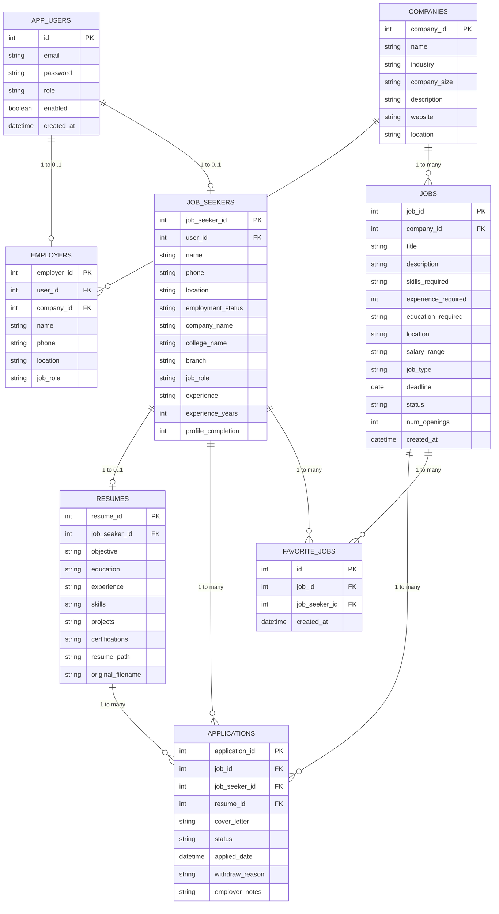

# RevHire - Entity-Relationship (ER) Diagram

This diagram outlines the relational structure mapping entities in the database.

```mermaid
erDiagram
    APP_USERS {
        int id PK
        string email
        string password
        string role
        boolean enabled
        datetime created_at
    }

    COMPANIES {
        int company_id PK
        string name
        string industry
        string company_size
        string description
        string website
        string location
    }

    EMPLOYERS {
        int employer_id PK
        int user_id FK
        int company_id FK
        string name
        string phone
        string location
        string job_role
    }

    JOB_SEEKERS {
        int job_seeker_id PK
        int user_id FK
        string name
        string phone
        string location
        string employment_status
        string company_name
        string college_name
        string branch
        string job_role
        string experience
        int experience_years
        int profile_completion
    }

    RESUMES {
        int resume_id PK
        int job_seeker_id FK
        string objective
        string education
        string experience
        string skills
        string projects
        string certifications
        string resume_path
        string original_filename
    }

    JOBS {
        int job_id PK
        int company_id FK
        string title
        string description
        string skills_required
        int experience_required
        string education_required
        string location
        string salary_range
        string job_type
        date deadline
        string status
        int num_openings
        datetime created_at
    }

    APPLICATIONS {
        int application_id PK
        int job_id FK
        int job_seeker_id FK
        int resume_id FK
        string cover_letter
        string status
        datetime applied_date
        string withdraw_reason
        string employer_notes
    }

    FAVORITE_JOBS {
        int id PK
        int job_id FK
        int job_seeker_id FK
        datetime created_at
    }

    APP_USERS ||--o| EMPLOYERS : "1 to 0..1"
    APP_USERS ||--o| JOB_SEEKERS : "1 to 0..1"
    
    COMPANIES ||--o{ EMPLOYERS : "1 to many"
    COMPANIES ||--o{ JOBS : "1 to many"
    
    JOB_SEEKERS ||--o| RESUMES : "1 to 0..1"
    JOB_SEEKERS ||--o{ APPLICATIONS : "1 to many"
    JOB_SEEKERS ||--o{ FAVORITE_JOBS : "1 to many"
    
    JOBS ||--o{ APPLICATIONS : "1 to many"
    JOBS ||--o{ FAVORITE_JOBS : "1 to many"
    RESUMES ||--o{ APPLICATIONS : "1 to many"
```
