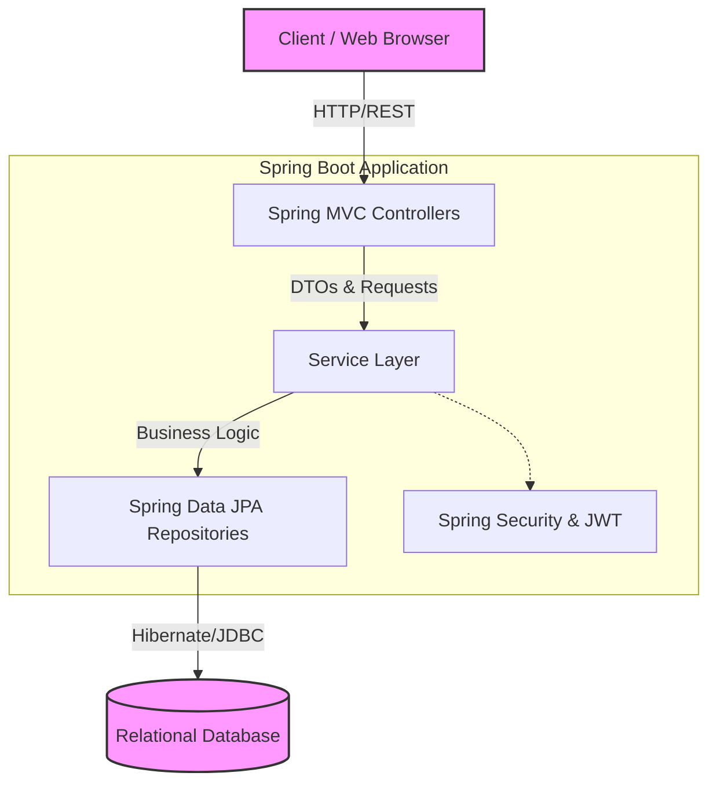

# RevHire - Project Documentation

## 1. Introduction
RevHire is a comprehensive job portal application designed to connect Job Seekers with Employers. It features a robust set of functionalities allowing employers to post and manage job listings, and job seekers to build profiles, upload resumes, and apply for jobs seamlessly.

The application is built using a modern Java Spring Boot backend, providing a secure, scalable, and efficient architecture. It manages user authentication, profile completeness, job postings, and application tracking.

## 2. System Architecture Diagram
The following architecture diagram represents the high-level system design of the RevHire platform:

