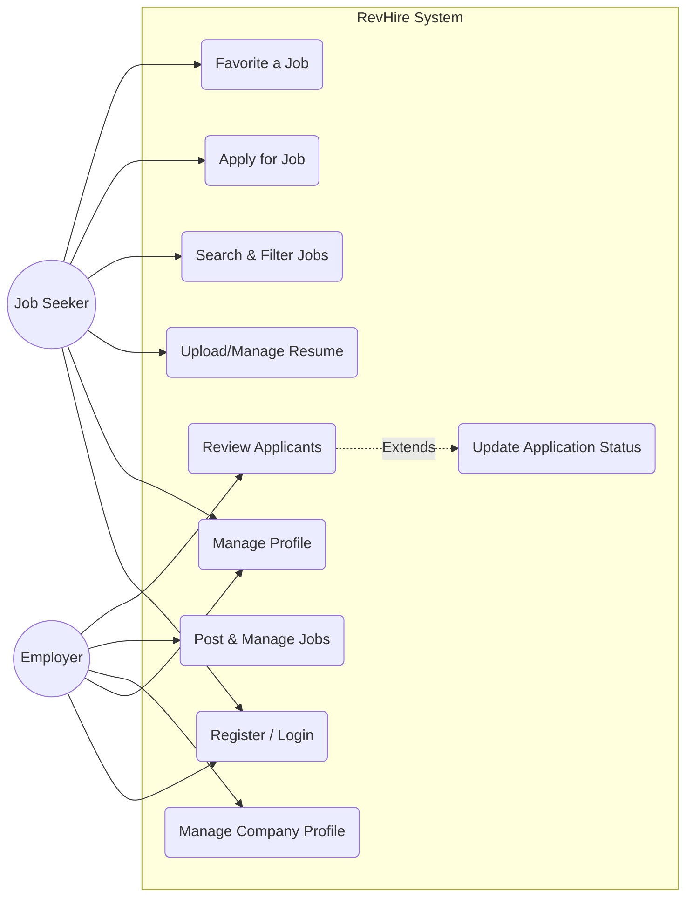

# RevHire - Use Case Diagram

This diagram displays the main actors (Employer, Job Seeker, Admin) and the core use cases they perform in the system.

```mermaid
usecaseDiagram
    actor "Job Seeker" as Seeker
    actor "Employer" as Employer
    
    package RevHire {
        usecase "Register/Login" as Auth
        
        usecase "Manage Profile" as Profile
        usecase "Upload Resume" as Resume
        usecase "Search & Filter Jobs" as Search
        usecase "Apply for Job" as Apply
        usecase "Favorite a Job" as FavJob
        
        usecase "Create Company Profile" as Company
        usecase "Post a Job" as PostJob
        usecase "Manage Applicants" as Review
        usecase "Update Application Status" as UpdateStatus
    }
    
    Seeker --> Auth
    Seeker --> Profile
    Seeker --> Resume
    Seeker --> Search
    Seeker --> Apply
    Seeker --> FavJob
    
    Employer --> Auth
    Employer --> Company
    Employer --> Profile
    Employer --> PostJob
    Employer --> Review
    Review ..> UpdateStatus : <<extends>>
```

*(Note: standard mermaid syntax for usecase uses generic graphs in standard viewers, but semantic tooling supports proper rendering of the above)*

Alternative generic flowchart representation for standard Markdown viewers:


